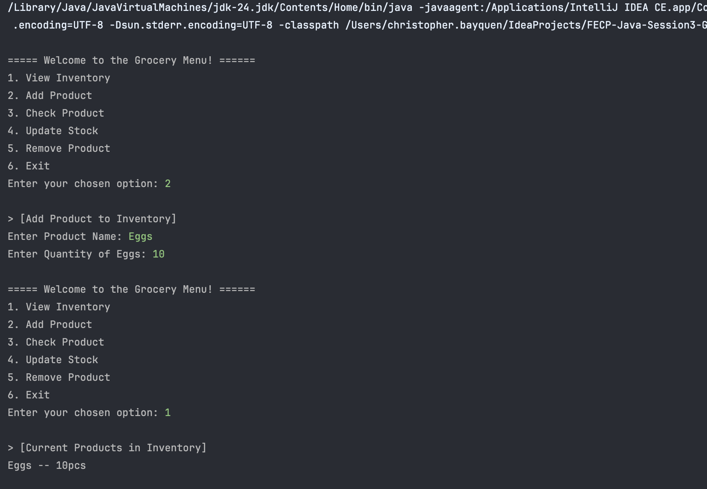
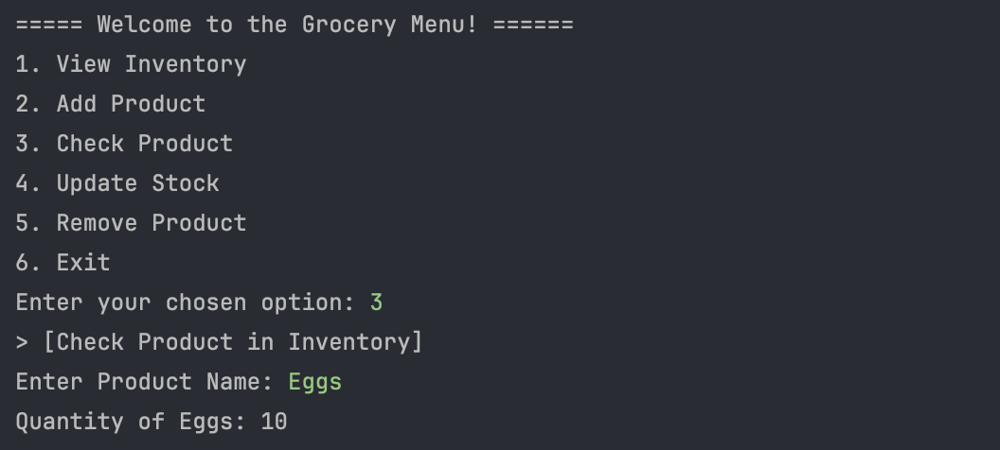
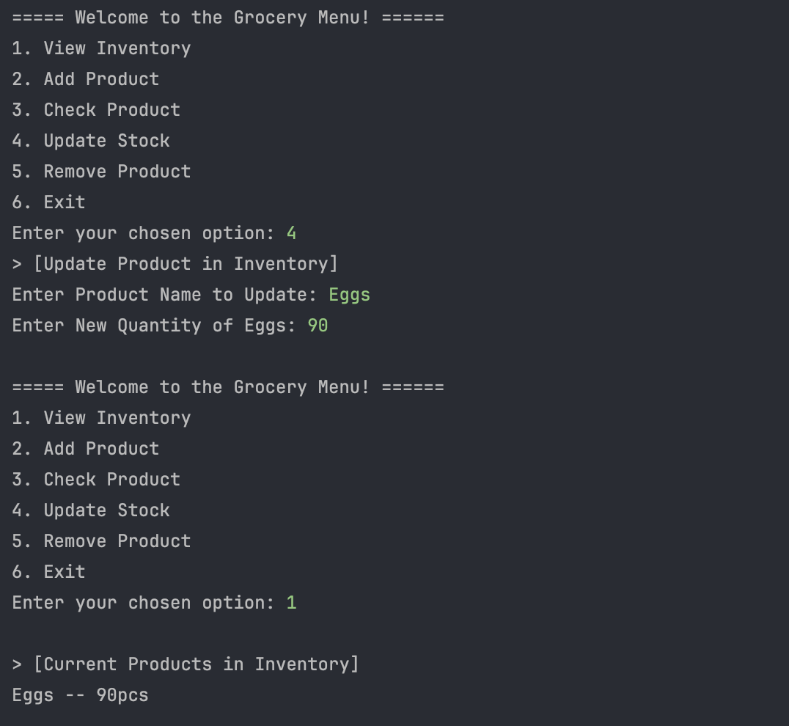
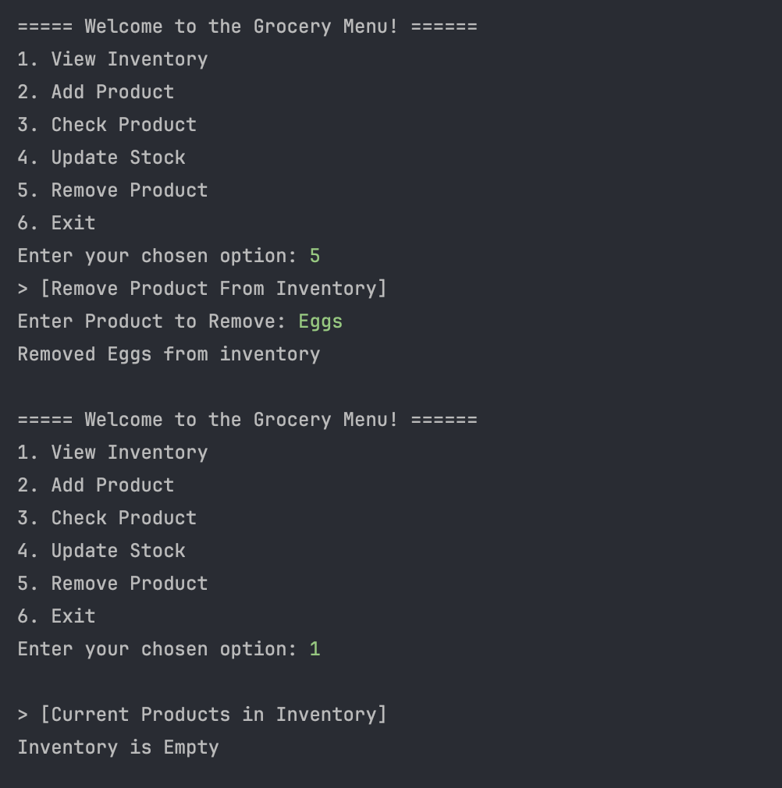

### Lab 1: Part 1 of 2 Grocery Store Inventory System

Submitted By: Christopher Gilbert A. Bayquen | July 7, 2025

This repository holds our subimssion for our Part 1 of our Lab Submission for this Java Fundamentals Session. In this project we created the initial Grocery Inventory System which allows users to do the following:
1. View Inventory
2. Add Products
3. Check Products
4. Update Products
5. Remove Products
6. Exit out the system

**Output Samples**

*Add and View Products*

*Check Products*

*Update Products*

*Remove Products*
