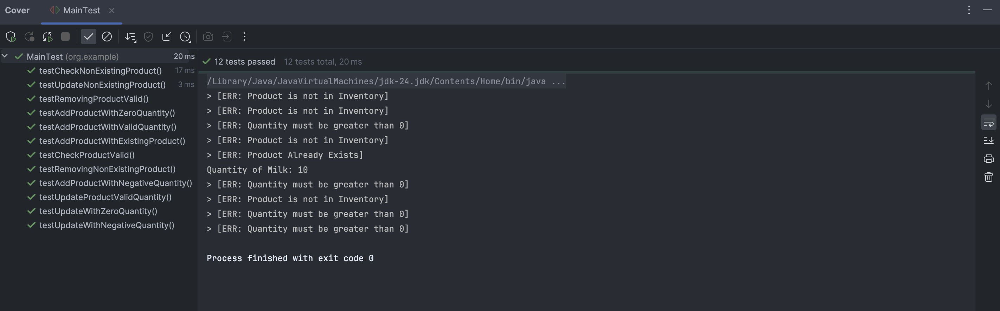
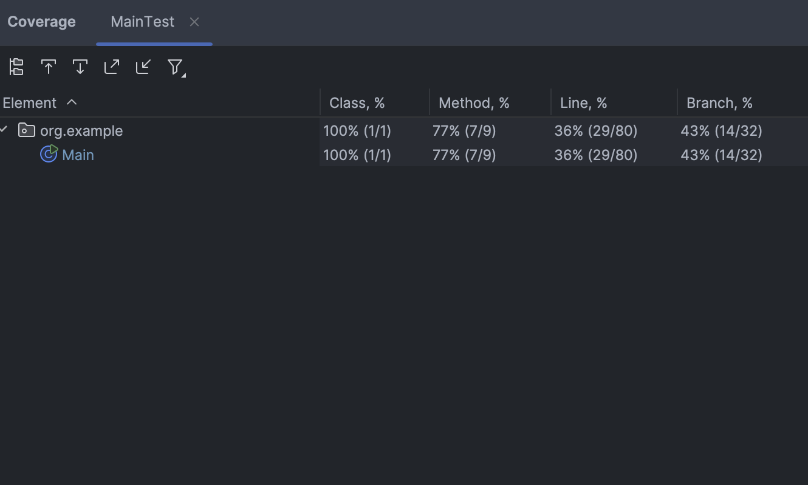

# Lab 1: Part 1 of 2 Grocery Store Inventory System

Submitted By: Christopher Gilbert A. Bayquen | July 7, 2025

This repository holds our submission for our Part 1 of our Lab Submission for this Java Fundamentals Session. In this project we created the initial Grocery Inventory System which allows users to do the following:
1. View Inventory
2. Add Products
3. Check Products
4. Update Products
5. Remove Products
6. Exit out the system

## **Output Samples**

*Add and View Products*

*Check Products*

*Update Products*

*Remove Products*

# Part 2 of 2 Grocery Store Inventory System : Unit Testing

For this section of the repository, we have implemented unit tests for the previously developed grocery store inventory system. The unit tests cover the following aspects:

1. Add Product Scenarios
   - Add Products with Valid Quantity
   - Add Product with Negative Quantity
   - Add Product with Zero Quantity
   - Add Already Existing Product
2. Check Product Scenarios
   - Check Existing Product
   - Check Non Existing Product

3. Update Stock Scenarios
   - Update Product with Valid Quantity
   - Update Product with Zero Quantity
   - Update Product with Negative Quantity
   - Update Non-Existing Product

4. Remove Product Scenarios
   - Remove Product 
   - Remove Non-Existing Product

## Output Samples

*Unit Testing Output*

*Unit Test Coverage*

Note: In this project I have created 2 helper methods: checkExistingProduct, and getProductQuantity which were not subjected to unit testing (Hence the 7/9 methods tested).